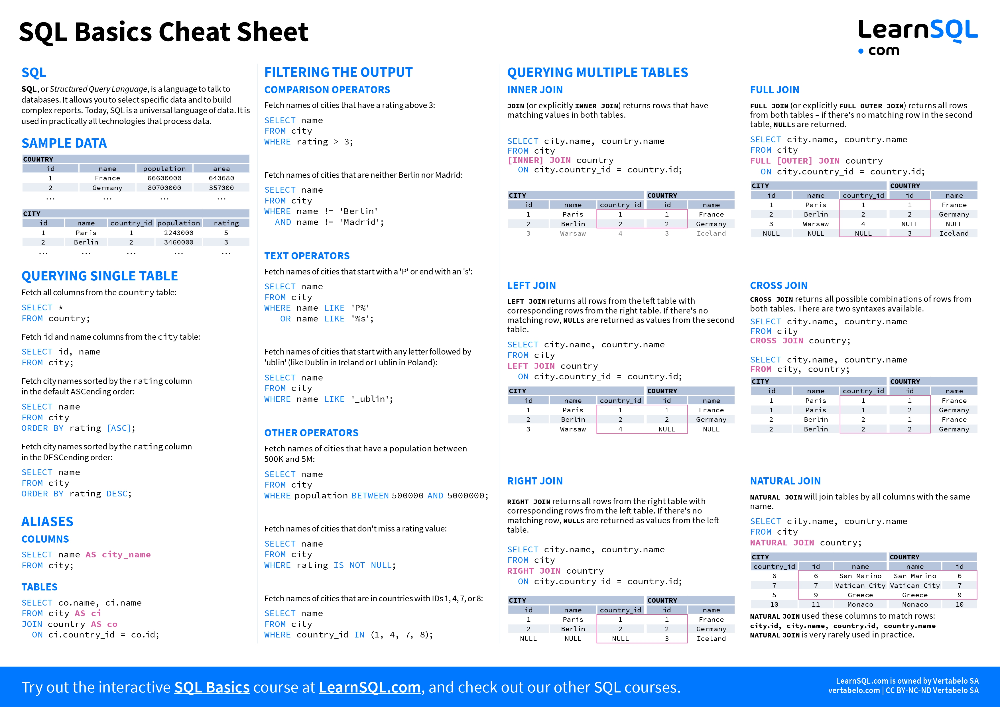

# MongoDb & SQL

- [MongoDb](#mongodb)
- [SQL](#sql)

# MongoDb

#### Install

    $ npm i mongoose

#### Connect

```
    import mongoose from 'mongoose';

    const connectionString = "string from mongodb atlas"

    mongoose.connect(connectionString, {
    useNewUrlParser: true,
    useCreateIndex: true,
    useFindAndModify: false,
    useUnifiedTopology: true,
});
```

#### Defining a schema

    const userSchema = new mongoose.Schema({
      fullName: {
        type: String,
        maxlength: 20,
        required: [true, "Name cant be Empty"]
        },
      phone: Number,
      verified: {type: Boolean, default: false}
    });

##### SchemaTypes

- String
- Number
- Date
- Buffer
- Boolean
- Mixed
- ObjectId
- Array

For more
[SchemaTypes](http://mongoosejs.com/docs/schematypes.html)

#### Query

[all query](https://mongoosejs.com/docs/api/query.html)

A model is a constructor compiled from a schema. Model instances represent a collection of documents.

##### Create a model

    const User = mongoose.model('User', userSchema);

    const u = User.create({fullName: "Name", phone: 0123456789, verified: true})

##### $find all

    User.find({});

##### $find by name

    User.find({ fullName: "Name" });

##### $find by multiple values

    User.find({ fullName: "Name", id: "123" });

##### $find one by id

    User.findOne({ _id: id });

##### $delete one by id

    User.findOneAndDelete({ _id: id });

##### $update one by id

    User.findOneAndUpdate({ _id: id }, updateData, {
      new: true,
      runValidators: true,
      overwrite: true // it will remove all the old data without default values and add the new data under the id
    });

##### $delete one by id

    User.findByIdAndRemove(id);

# SQL




